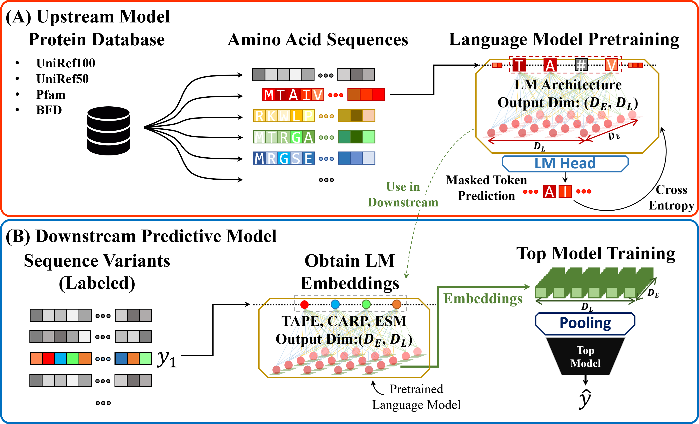
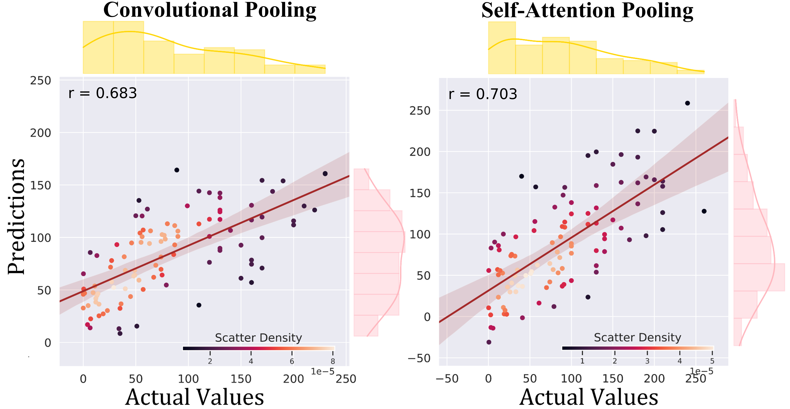

# Protein Sequence-to-Function Learning with Pretrained Language Models

This repository presents a benchmarking framework for sequence-to-function prediction using frozen protein language model (pLM) embeddings. A novel pooling strategy—convolutional pooling—is proposed to extract task-specific features from fixed pLM representations. The approach is evaluated across four benchmark datasets and compared to strong baselines, demonstrating competitive performance while maintaining computational efficiency.

## Pipeline Overview

The figure below illustrates the full workflow for protein sequence-to-function learning using pLM embeddings. Protein sequences are first embedded using pretrained models (e.g., ESM), followed by task-specific feature aggregation using either self-attention pooling or convolutional pooling. The resulting representations are used to predict functional properties such as activity or fitness.

  

---

## Benchmarking Results

### 1. GB1 Fitness Prediction (FLIP Benchmark)

<table>
  <thead>
    <tr>
      <th>Model</th>
      <th>1-vs-rest</th>
      <th>2-vs-rest</th>
      <th>3-vs-rest</th>
      <th>low-vs-high</th>
    </tr>
  </thead>
  <tbody>
    <tr>
      <td>ESM-1b + ConvPool</td>
      <td>0.310 ± 0.020</td>
      <td><b>0.646 ± 0.006</b></td>
      <td><b>0.878 ± 0.003</b></td>
      <td>0.433 ± 0.010</td>
    </tr>
    <tr>
      <td>ESM-1b + AttPool</td>
      <td><b>0.334 ± 0.012</b></td>
      <td>0.619 ± 0.007</td>
      <td>0.852 ± 0.005</td>
      <td><b>0.447 ± 0.004</b></td>
    </tr>
    <tr>
      <td>FLIP (Best Baseline)</td>
      <td>0.32</td>
      <td>0.59</td>
      <td>0.83</td>
      <td>0.59</td>
    </tr>
  </tbody>
</table>

---

### 2. β-Lactamase Activity Prediction

  

<table>
  <thead>
    <tr>
      <th>Model</th>
      <th>Parameters</th>
      <th>Spearman’s ρ</th>
    </tr>
  </thead>
  <tbody>
    <tr>
      <td>ESM-1b + ConvPool</td>
      <td>~1.7M</td>
      <td><b>0.886 ± 0.007</b></td>
    </tr>
    <tr>
      <td>ESM-1b + AttPool</td>
      <td>~1.4M</td>
      <td>0.828 ± 0.014</td>
    </tr>
    <tr>
      <td>Fine-Tuned ESM-1b</td>
      <td>~650M</td>
      <td>0.839 ± 0.053</td>
    </tr>
    <tr>
      <td>ESM-1b + AvgPool</td>
      <td>~0.9M</td>
      <td>0.528 ± 0.009</td>
    </tr>
  </tbody>
</table>

---

### 3. PafA Enzymatic Activity Prediction

  

<table>
  <thead>
    <tr>
      <th>Pooling Method</th>
      <th>Model</th>
      <th>Pearson’s r</th>
      <th>Spearman’s ρ</th>
    </tr>
  </thead>
  <tbody>
    <tr>
      <td>Convolutional Pool</td>
      <td>ESM-2</td>
      <td>0.594 ± 0.072</td>
      <td>0.600 ± 0.059</td>
    </tr>
    <tr>
      <td>Self-Attention Pool</td>
      <td>ESM-2</td>
      <td><b>0.619 ± 0.047</b></td>
      <td><b>0.641 ± 0.039</b></td>
    </tr>
  </tbody>
</table>

---

### 4. avGFP Fluorescence Landscape Prediction

<table>
  <thead>
    <tr>
      <th>Model</th>
      <th>Parameters</th>
      <th>Spearman’s ρ</th>
    </tr>
  </thead>
  <tbody>
    <tr>
      <td>ESM-1b + ConvPool</td>
      <td>~5.5M</td>
      <td>0.662 ± 0.002</td>
    </tr>
    <tr>
      <td>ESM-1b + AttPool</td>
      <td>~3.5M</td>
      <td>0.651 ± 0.003</td>
    </tr>
    <tr>
      <td>Fine-Tuned ESM-1b</td>
      <td>~650M</td>
      <td><b>0.679 ± 0.002</b></td>
    </tr>
    <tr>
      <td>ESM-1b + AvgPool</td>
      <td>~0.9M</td>
      <td>0.430 ± 0.002</td>
    </tr>
    <tr>
      <td>eUniRep + Ridge Regression</td>
      <td>Non-neural top model used</td>
      <td>0.427 ± 0.003</td>
    </tr>
  </tbody>
</table>

---

## Summary

This framework demonstrates that simple yet effective pooling strategies applied to pretrained pLM embeddings can achieve competitive performance across diverse protein function prediction tasks. Convolutional pooling, in particular, offers strong predictive power for mutation effect datasets with high sequence similarity, while attention pooling excels in tasks requiring generalization to unseen residues.

## Pipeline.

- N00_Data_Preprocessing.py     : Preprocess and the dataset.
- N03_LM_Embeddings.py          : Get sequence embeddings.
- N05X_SQemb_y.py               : Train the model and evaluate.

